# Online-Shop für Elektronik

Voll funktionsfähige Webanwendung mit Backend und Frontend. Unterstützt Registrierung, Login, Produktverwaltung, Kommentare, Bewertungen, Warenkorb und ein Admin-Panel.

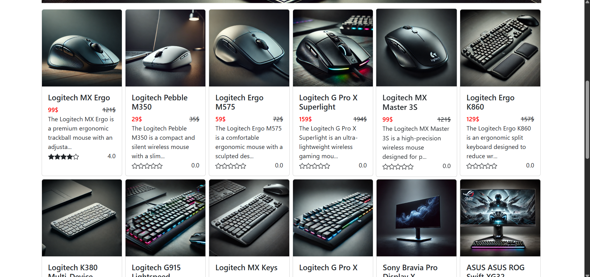

---

## Funktionen

- Registrierung und Login mit JWT
- Admin-Bereich:
  - Hinzufügen von Marken, Gerätetypen und Produkten
  - Massen-Upload von Geräten über eine JSON-Datei
- Nutzerbereich:
  - Produktanzeige nach Kategorien
  - Filterung und Sortierung
  - Hinzufügen zum Warenkorb
  - Kommentarfunktion und Bewertungssystem
- Fehlerbehandlung und Validierung
- Responsives Design für alle Bildschirmgrößen

---

## Technologien

### Backend:

- Node.js + Express
- PostgreSQL + Sequelize ORM
- JWT für Authentifizierung
- REST API

### Frontend:

- React.js
- React-Bootstrap
- React Router DOM
- MobX (State Management)
- Axios für HTTP-Anfragen

---

## Online-Zugang

Das Projekt ist auf meinem eigenen Server (Raspberry Pi 4) gehostet, der bei mir zu Hause läuft. Eingesetzte Technologien:

- Ubuntu Server 22.04
- Cloudflare Tunnel für sicheren externen Zugriff
- HTTPS-Zertifikate
- Eigene Domain
- Demo: [https://store.bilytskyi.com](https://store.bilytskyi.com)
- Benutzername: admin, Passwort: admin (oder erstelle einen neuen Benutzer)

---

## Screenshots

### Hero-Bereich

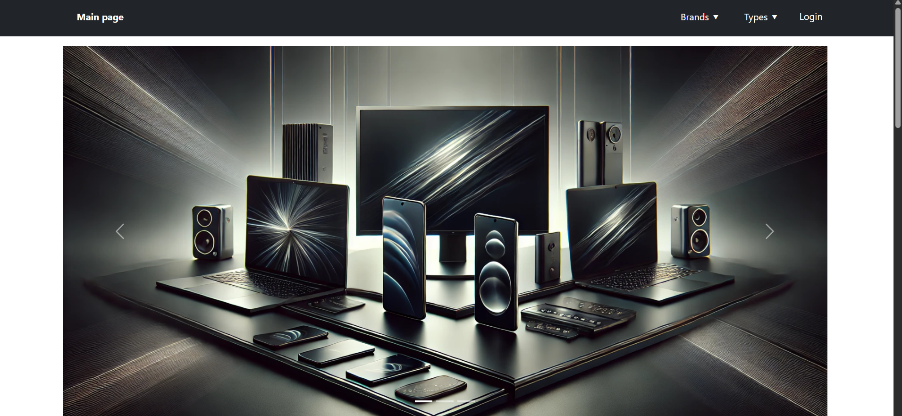

### Gerätekatalog

### Footer

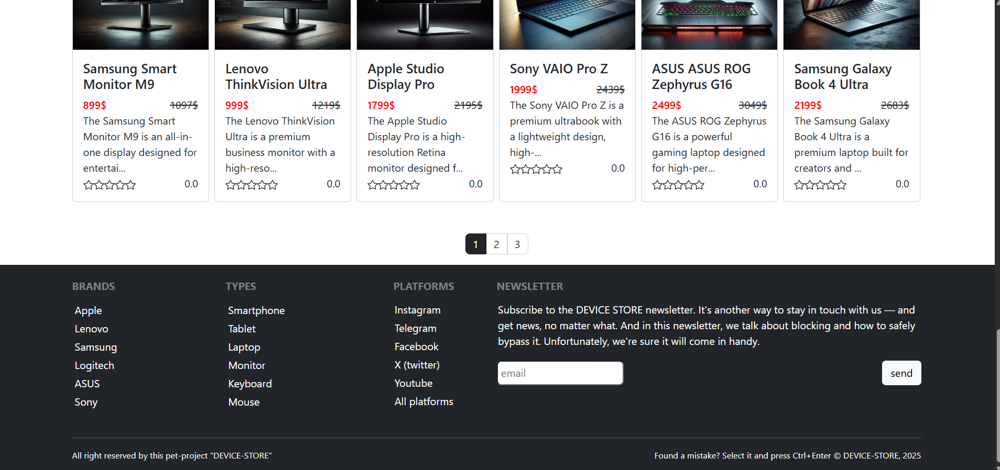

### Produktseite

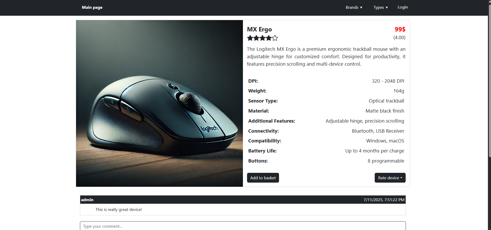

### Login

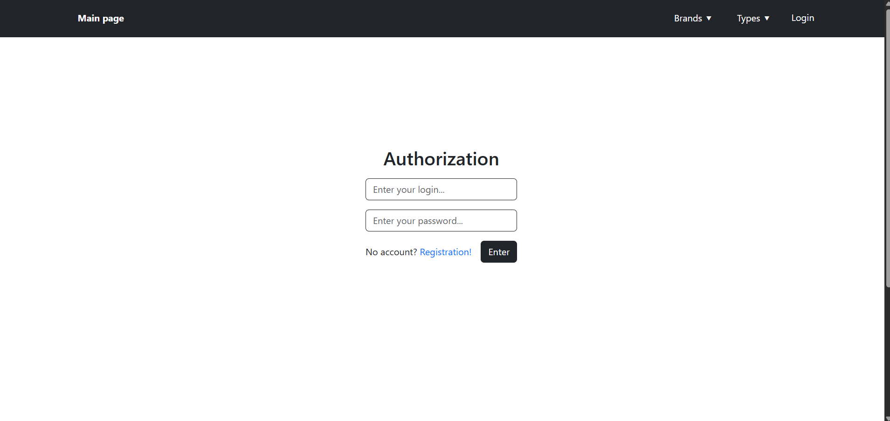

### Neues Gerät hinzufügen

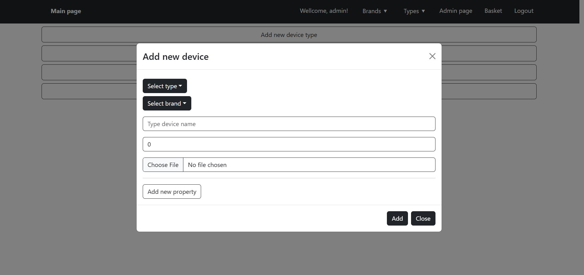

### Admin-Panel

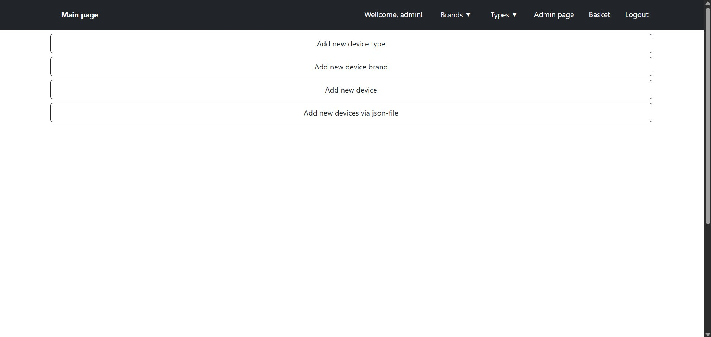

### In den Warenkorb legen

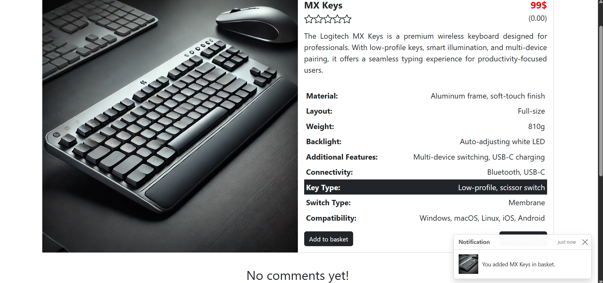

### Warenkorb

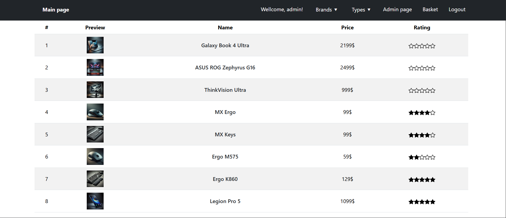

### Mobile Ansicht

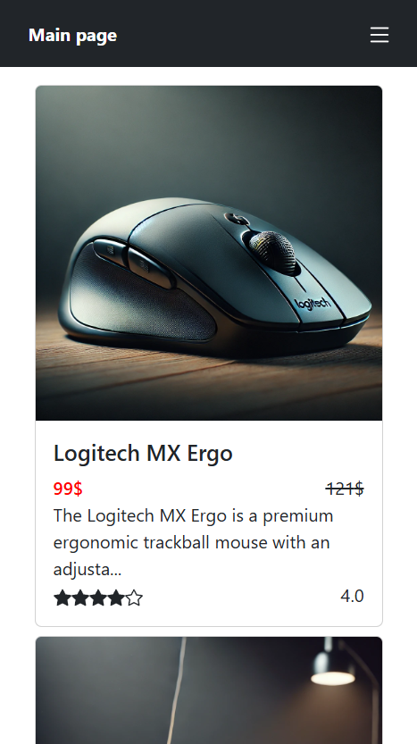

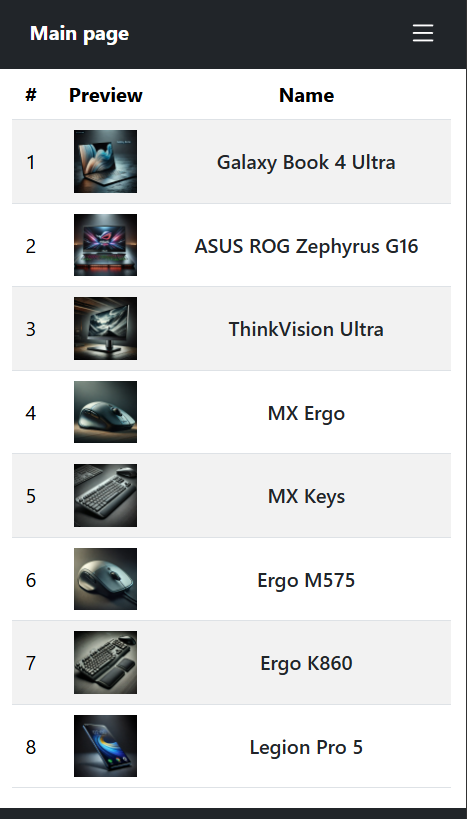

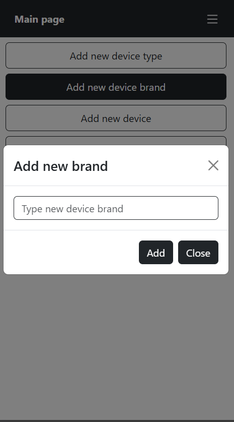

### Server

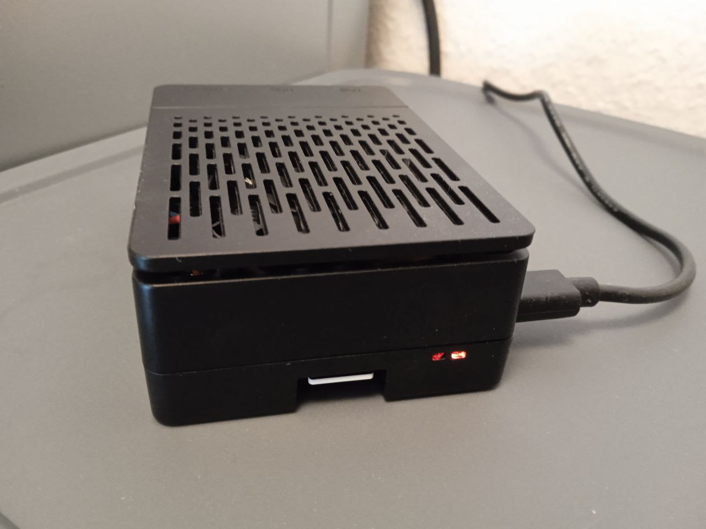
